# GhostBid - FHE-Powered Sealed-Bid NFT Auctions

A privacy-preserving NFT auction platform using Zama's Fully Homomorphic Encryption (FHE) technology. Bidders can submit encrypted bids that remain private until the auction ends.

<p>
    <a href="https://ghostbid.vercel.app/">🌐 GHOSTBID LIVE</a> •
    <a href="https://www.youtube.com/">🎥 GhostBid Demo Video</a> •
  </p>


## 🔐 Key Features

- **Sealed Bids**: All bids are encrypted using FHE before submission
- **Privacy-Preserving**: Bid amounts remain hidden until auction finalization
- **Transparent Audit**: Encrypted bids visible on-chain for verification
- **Homomorphic Comparison**: Winner determined without decrypting bids
- **Optional Reveal**: Winner can be revealed after finalization

## 🏗️ Architecture

- **Smart Contracts**: Solidity 0.8.24 with Zama fhEVM
- **Frontend**: React + TypeScript + Vite
- **Blockchain**: Ethereum Sepolia Testnet (or local Hardhat)
- **FHE**: Zama FHE SDK (`@zama-fhe/relayer-sdk`)
- **On-Chain FHE**: ZamaMaxAdapter for homomorphic maximum computation

### Contract Architecture

```
┌─────────────────┐
│ AuctionManager  │  ← Registry contract (creates auctions)
└────────┬────────┘
         │
         │ creates
         ▼
┌─────────────────┐
│EncryptedAuction │  ← Core auction logic (stores encrypted bids)
└────────┬────────┘
         │
         │ uses
         ▼
┌─────────────────┐
│ ZamaMaxAdapter  │  ← FHE computation (finds max encrypted bid)
└─────────────────┘
```

## 📊 System Flow & Sequence Diagram

### Complete Auction Flow

```mermaid
sequenceDiagram
    participant Seller
    participant Frontend
    participant ZamaSDK
    participant AuctionManager
    participant EncryptedAuction
    participant ZamaMaxAdapter
    participant Bidder1
    participant Bidder2
    participant Blockchain

    Note over Seller,Blockchain: Phase 1: Auction Creation
    Seller->>Frontend: Create Auction (NFT, params)
    Frontend->>AuctionManager: createAuction(nftContract, tokenId, ...)
    AuctionManager->>EncryptedAuction: createAuction(seller, ...)
    EncryptedAuction-->>AuctionManager: auctionId
    AuctionManager-->>Frontend: auctionId
    Frontend-->>Seller: Auction Created ✓

    Note over Seller,Blockchain: Phase 2: Configure FHE Adapter
    Seller->>Frontend: Set FHE Adapter
    Frontend->>EncryptedAuction: setFHEAdapter(auctionId, adapterAddress)
    EncryptedAuction-->>Frontend: Adapter Set ✓

    Note over Bidder1,Blockchain: Phase 3: Bid Submission (Encrypted)
    Bidder1->>Frontend: Enter Bid Amount (e.g., 0.5 ETH)
    Frontend->>ZamaSDK: encryptBid(amount, contractAddress)
    ZamaSDK->>ZamaSDK: Create encrypted input (euint64)
    ZamaSDK->>ZamaSDK: Generate input proof (EIP712 signature)
    ZamaSDK-->>Frontend: {ciphertext, proof}
    Frontend->>EncryptedAuction: submitEncryptedBid(auctionId, ciphertext, proof, commitment)
    EncryptedAuction->>EncryptedAuction: FHE.fromExternal() - Verify proof
    EncryptedAuction->>EncryptedAuction: FHE.allow() - Grant access
    EncryptedAuction->>Blockchain: Store encrypted bid (euint64)
    EncryptedAuction-->>Frontend: EncryptedBidSubmitted event
    Frontend-->>Bidder1: Bid Submitted ✓

    Bidder2->>Frontend: Enter Bid Amount (e.g., 0.75 ETH)
    Frontend->>ZamaSDK: encryptBid(amount, contractAddress)
    ZamaSDK-->>Frontend: {ciphertext, proof}
    Frontend->>EncryptedAuction: submitEncryptedBid(...)
    EncryptedAuction->>Blockchain: Store encrypted bid
    EncryptedAuction-->>Frontend: EncryptedBidSubmitted event

    Note over Seller,Blockchain: Phase 4: Auction Finalization
    Seller->>Frontend: Finalize Auction (after endTime)
    Frontend->>EncryptedAuction: finalizeAuctionWithAdapter(auctionId)
    EncryptedAuction->>EncryptedAuction: Collect all bid ciphertexts
    EncryptedAuction->>EncryptedAuction: FHE.allow() for each bid → adapter
    EncryptedAuction->>ZamaMaxAdapter: fhe_max([ciphertext1, ciphertext2, ...])
    
    Note over ZamaMaxAdapter: Homomorphic Comparison
    ZamaMaxAdapter->>ZamaMaxAdapter: Loop: FHE.gt(candidate, currentMax)
    ZamaMaxAdapter->>ZamaMaxAdapter: FHE.select() - Choose maximum
    ZamaMaxAdapter-->>EncryptedAuction: winnerCiphertext (encrypted)
    
    EncryptedAuction->>Blockchain: Store winnerCiphertext
    EncryptedAuction-->>Frontend: AuctionFinalized event
    Frontend-->>Seller: Auction Finalized ✓

    Note over Seller,Blockchain: Phase 5: Winner Revelation (Optional)
    Seller->>Frontend: Reveal Winner
    Frontend->>EncryptedAuction: revealWinner(auctionId, winner, amount)
    EncryptedAuction->>Blockchain: Store winner address
    EncryptedAuction-->>Frontend: WinnerRevealed event
    Frontend-->>Seller: Winner: Bidder2 (0.75 ETH) ✓
```



### Workflow Summary

#### 1. **Auction Creation**
- Seller calls `AuctionManager.createAuction()` with NFT details, timing, and parameters
- `AuctionManager` forwards to `EncryptedAuction.createAuction()`
- Auction is stored with `auctionId`, seller, NFT contract, time windows, and limits

#### 2. **FHE Adapter Configuration**
- Seller sets the `ZamaMaxAdapter` address via `setFHEAdapter()`
- This adapter will perform homomorphic maximum computation on-chain

#### 3. **Encrypted Bid Submission**
- **Client-Side Encryption**:
  - Bidder enters bid amount in frontend
  - Zama SDK (`@zama-fhe/relayer-sdk`) encrypts the amount as `euint64`
  - SDK generates an EIP712 input proof (signature) for verification
  - Returns `ciphertext` (32-byte handle) and `inputProof`
- **On-Chain Submission**:
  - Bidder calls `submitEncryptedBid(auctionId, ciphertext, proof, commitment)`
  - Contract verifies proof via `FHE.fromExternal()` - ensures ciphertext is valid
  - Contract grants itself access via `FHE.allow()`
  - Encrypted bid stored as `euint64` in contract storage
  - Bidder's address and deposit stored (plaintext)

#### 4. **Auction Finalization**
- After `endTime`, anyone can call `finalizeAuctionWithAdapter()`
- Contract collects all encrypted bids (`euint64[]`)
- Grants `ZamaMaxAdapter` access to each bid via `FHE.allow()`
- Calls `ZamaMaxAdapter.fhe_max([ciphertext1, ciphertext2, ...])`
- **Homomorphic Computation**:
  - Adapter loops through ciphertexts
  - Uses `FHE.gt()` to compare encrypted values
  - Uses `FHE.select()` to choose the maximum
  - Returns encrypted winner ciphertext
- Contract stores `winnerCiphertext` (still encrypted) and marks auction as finalized

#### 5. **Winner Revelation (Optional)**
- Seller can call `revealWinner()` to store the plaintext winner address and amount
- This requires off-chain decryption of `winnerCiphertext` using Zama's decryption oracle

### Key FHE Concepts

1. **Encryption**: Bid amounts encrypted client-side using Zama SDK → `euint64` type
2. **Verification**: Input proofs ensure ciphertexts are valid encrypted values
3. **Access Control**: `FHE.allow()` grants contracts permission to operate on encrypted data
4. **Homomorphic Operations**: `FHE.gt()` and `FHE.select()` compare/select without decryption
5. **Privacy**: Bid amounts never decrypted on-chain during comparison

## 📦 Deployed Contracts (Sepolia Testnet)

### Main Contracts

- **EncryptedAuction**: `0xc9850ef02d3f38B2aE77DF3be23fe3790F135FE6`
  - Core auction contract storing encrypted bids
  - Handles bid submission, finalization, and winner revelation

- **AuctionManager**: `0x2edD3d6a6dd0DeC461A075d0f66885C1Ed0B0b89`
  - Registry contract for creating and managing auctions
  - Routes auction creation to `EncryptedAuction`

- **ZamaMaxAdapter**: Check `deployments/sepolia/ZamaMaxAdapter.json` for latest address
  - On-chain FHE adapter for computing encrypted maximum
  - Implements `IFHE` interface with `fhe_max()` function

### Sample Contract Addresses for Testing

When creating auctions, you can use these sample NFT contract addresses (for testing purposes):

| Address | Description |
|---------|-------------|
| `0x1f9840a85d5aF5bf1D1762F925BDADdC4201F984` | Uniswap Token (commonly used for testing) |
| `0x7b79995e5f793A07Bc00c21412e50Ecae098E7f9` | Wrapped ETH (WETH) |
| `0x5FbDB2315678afecb367f032d93F642f64180aa3` | Mock NFT Contract |
| `0xe7f1725E7734CE288F8367e1Bb143E90bb3F0512` | Generic Test Contract |
| `0x9fE46736679d2D9a65F0992F2272dE9f3c7fa6e0` | Sample NFT Collection |

**Note**: The auction contract doesn't verify NFT ownership in the current implementation - it just stores the address. For production, you would need to:
1. Deploy a real ERC-721 NFT contract
2. Mint NFTs to the seller's address
3. Approve the auction contract to transfer the NFT
4. Verify ownership before creating auction

See `SAMPLE_NFT_ADDRESSES.txt` for more test addresses.

## 🚀 Quick Start

### Prerequisites

- Node.js 18+
- MetaMask wallet
- Sepolia ETH (from faucets)

### Local Development

```bash
# Install dependencies
cd ghostbid
npm install

cd frontend
npm install

# Start local blockchain (optional)
cd ../
npx hardhat node

# Deploy contracts
npx hardhat deploy --network sepolia

# Start frontend
cd frontend
npm run dev
```

### Deploy to Vercel (Recommended for Real FHE)

```bash
# Install Vercel CLI
npm install -g vercel

# Deploy
cd ghostbid/frontend
vercel --prod
```

The Vercel deployment includes proper CORS headers for the Zama FHE SDK.

## 🎯 Usage Guide

### For Sellers

1. **Create Auction**:
   - Navigate to "Create Auction" page
   - Enter NFT contract address and token ID
   - Set reserve price (minimum bid in ETH)
   - Set start time and end time
   - Set maximum number of bidders
   - Submit transaction via MetaMask
   - **Important**: After creation, set the FHE adapter address via `setFHEAdapter()`

2. **Configure FHE Adapter**:
   - Deploy `ZamaMaxAdapter` contract (or use existing deployment)
   - Call `setFHEAdapter(auctionId, adapterAddress)` on `EncryptedAuction`
   - This enables on-chain FHE computation for finalization

3. **Finalize Auction**:
   - Wait for auction `endTime` to pass
   - Call `finalizeAuctionWithAdapter(auctionId)`
   - Contract will compute encrypted winner using `ZamaMaxAdapter`
   - Winner ciphertext stored (still encrypted)

4. **Reveal Winner** (Optional):
   - Decrypt `winnerCiphertext` off-chain using Zama decryption oracle
   - Call `revealWinner(auctionId, winnerAddress, amountWei)`
   - Winner address and amount stored on-chain

### For Bidders

1. **Submit Encrypted Bid**:
   - Navigate to auction page
   - Enter bid amount (in ETH)
   - Enter salt/secret phrase (for commitment)
   - Click "Submit Encrypted Bid"
   - Frontend encrypts bid using Zama SDK
   - Transaction submitted with encrypted ciphertext and proof
   - Deposit (minimum required) sent with bid

2. **View Auction Status**:
   - See encrypted bids on-chain (ciphertext handles only)
   - View bid count and auction timing
   - Monitor countdown timer

### Data Flow Diagram

```
┌─────────────┐
│   Bidder    │
│  (Browser)  │
└──────┬──────┘
       │
       │ 1. Enter bid amount (0.5 ETH)
       ▼
┌─────────────────┐
│  Zama SDK       │
│  (Client-Side)  │
└──────┬──────────┘
       │
       │ 2. Encrypt: amount → euint64
       │    Generate: inputProof (EIP712)
       │    Output: {ciphertext: bytes32, proof: bytes}
       ▼
┌─────────────────┐
│  Frontend       │
│  (React)        │
└──────┬──────────┘
       │
       │ 3. submitEncryptedBid(auctionId, ciphertext, proof, commitment)
       ▼
┌─────────────────┐
│EncryptedAuction │
│  (Smart Contract)│
└──────┬──────────┘
       │
       │ 4. FHE.fromExternal() - Verify proof
       │    FHE.allow() - Grant access
       │    Store: euint64 ciphertext
       ▼
┌─────────────────┐
│   Blockchain    │
│  (Storage)      │
└─────────────────┘

[After Auction Ends]

┌─────────────────┐
│EncryptedAuction │
└──────┬──────────┘
       │
       │ 5. Collect all euint64 bids
       │    FHE.allow() each → adapter
       ▼
┌─────────────────┐
│ ZamaMaxAdapter  │
└──────┬──────────┘
       │
       │ 6. fhe_max([ciphertext1, ciphertext2, ...])
       │    Loop: FHE.gt() + FHE.select()
       │    Return: encrypted winner (euint64)
       ▼
┌─────────────────┐
│EncryptedAuction │
└──────┬──────────┘
       │
       │ 7. Store winnerCiphertext (still encrypted!)
       ▼
┌─────────────────┐
│   Blockchain    │
└─────────────────┘
```

## 🔧 Configuration

### Environment Variables

**Backend (`ghostbid/.env`)**:
```env
# Blockchain Configuration
RPC_URL=https://eth-sepolia.g.alchemy.com/v2/YOUR_API_KEY
PRIVATE_KEY=YOUR_PRIVATE_KEY

# Contract Addresses (after deployment)
AUCTION_CONTRACT=0xc9850ef02d3f38B2aE77DF3be23fe3790F135FE6
AUCTION_ID=1

# FHE Configuration (for scripts)
FHE_ACL_ADDRESS=0x0000000000000000000000000000000000000000
FHE_INPUT_VERIFIER=0x0000000000000000000000000000000000000000
FHE_KMS_ADDRESS=0x0000000000000000000000000000000000000000
FHE_DECRYPTION_VERIFIER=0x0000000000000000000000000000000000000000
FHE_GATEWAY_CHAIN_ID=31337
FHE_CHAIN_ID=11155111
ZAMA_RELAYER_ENDPOINT=https://api.zama.ai/relayer
ZAMA_API_KEY=demo
```

**Frontend (`ghostbid/frontend/.env`)**:
```env
# Blockchain Configuration
VITE_RPC_URL=https://eth-sepolia.g.alchemy.com/v2/YOUR_API_KEY

# Contract Addresses
VITE_ENCRYPTED_AUCTION=0xc9850ef02d3f38B2aE77DF3be23fe3790F135FE6
VITE_AUCTION_MANAGER=0x2edD3d6a6dd0DeC461A075d0f66885C1Ed0B0b89

# FHE Configuration
VITE_ZAMA_RELAYER_ENDPOINT=https://api.zama.ai/relayer
VITE_ZAMA_API_KEY=demo
VITE_FHE_ACL_ADDRESS=0x0000000000000000000000000000000000000000
VITE_FHE_INPUT_VERIFIER=0x0000000000000000000000000000000000000000
VITE_FHE_KMS_ADDRESS=0x0000000000000000000000000000000000000000
VITE_FHE_DECRYPTION_VERIFIER=0x0000000000000000000000000000000000000000
VITE_FHE_GATEWAY_CHAIN_ID=31337
VITE_FHE_CHAIN_ID=11155111
```

**Note**: For Sepolia testnet, use the official Zama FHE contract addresses. Check [Zama Documentation](https://docs.zama.ai/fhevm) for the latest addresses.

## 📚 Tech Stack

- **Solidity 0.8.24**: Smart contract language
- **Hardhat**: Development environment
- **React 18**: Frontend framework
- **TypeScript**: Type safety
- **Vite**: Build tool
- **ethers.js**: Ethereum library
- **Zama fhEVM**: FHE for Ethereum
- **TailwindCSS**: Styling

## 🧪 Testing

### Contract Tests

```bash
# Run all Hardhat tests (includes fhEVM tests)
cd ghostbid
npx hardhat test

# Run specific test file
npx hardhat test test/EncryptedAuction.fhevm.ts

# Run with coverage
npm run test:coverage
```

### Frontend Development

```bash
# Start development server
cd frontend
npm run dev

# Type check
npm run typecheck

# Lint
npm run lint
```

### Scripts for Testing

```bash
# Deploy contracts to local network
npx hardhat node
npx hardhat run scripts/deploy.ts --network localhost

# Simulate auction with multiple bids
npx hardhat run scripts/simulate_auction.ts --network localhost

# Finalize auction (relayer script)
npx hardhat run scripts/relayer.ts --network localhost
```

## 📋 Smart Contract Interfaces

### EncryptedAuction

Key functions:

- `createAuction(seller, nftContract, tokenId, startTime, endTime, maxBidders, minDepositWei)` - Creates new auction
- `submitEncryptedBid(auctionId, ciphertextHandle, inputProof, commitment)` - Submit encrypted bid (payable)
- `setFHEAdapter(auctionId, adapter)` - Set FHE adapter for auction (seller only)
- `finalizeAuctionWithAdapter(auctionId)` - Finalize auction using on-chain adapter
- `submitFinalizedWinner(auctionId, winnerCiphertext)` - Fallback: accept off-chain computed winner
- `revealWinner(auctionId, winner, amountWei)` - Store plaintext winner (optional)
- `getBidCount(auctionId)` - Get number of bids
- `getBidCiphertext(auctionId, index)` - Get encrypted bid handle
- `getWinnerCiphertext(auctionId)` - Get encrypted winner

### AuctionManager

Key functions:

- `createAuction(nftContract, tokenId, startTime, endTime, maxBidders, minDepositWei)` - Create auction (forwards to EncryptedAuction)
- `getAuction(auctionId)` - Get auction metadata

### ZamaMaxAdapter (IFHE)

Key functions:

- `fhe_max(ciphertextHandles[])` - Compute encrypted maximum from array of encrypted bids
  - Uses `FHE.gt()` for comparison
  - Uses `FHE.select()` for selection
  - Returns encrypted winner handle

## 📖 How FHE Works in GhostBid

### Encryption Flow

1. **Client-Side Encryption**:
   - Bidder enters bid amount (e.g., "0.5" ETH) in frontend
   - Zama SDK (`@zama-fhe/relayer-sdk/web`) initializes with FHE configuration
   - SDK creates encrypted input: `createEncryptedInput(contractAddress, account)`
   - Adds bid amount as `euint64`: `input.add64(ethers.parseUnits(amount, 18))`
   - Encrypts and generates EIP712 input proof (signature)
   - Returns `{ciphertext: bytes32, proof: bytes, account: address}`

2. **On-Chain Verification**:
   - Contract receives `ciphertext` (32-byte handle) and `inputProof`
   - `FHE.fromExternal()` verifies the proof and wraps as `euint64`
   - `FHE.allow()` grants contract permission to operate on encrypted data
   - Encrypted bid stored on-chain as `euint64` type

3. **Homomorphic Operations**:
   - All bids remain encrypted throughout the auction
   - `ZamaMaxAdapter` uses `FHE.gt()` to compare encrypted values
   - `FHE.select()` chooses the maximum without decryption
   - Winner determination happens entirely on encrypted data

4. **Winner Determination**:
   - After auction ends, `finalizeAuctionWithAdapter()` is called
   - Contract grants adapter access to all encrypted bids
   - Adapter computes `fhe_max([ciphertext1, ciphertext2, ...])`
   - Returns encrypted winner ciphertext (still encrypted!)
   - Stored as `winnerCiphertext` in contract

5. **Optional Decryption**:
   - Winner can be revealed using Zama's decryption oracle
   - Requires off-chain decryption of `winnerCiphertext`
   - Plaintext winner address and amount stored via `revealWinner()`

### Privacy Guarantees

- ✅ **Bid amounts never decrypted on-chain** during comparison
- ✅ **Only ciphertext handles stored** on blockchain (32 bytes each)
- ✅ **Homomorphic operations** preserve privacy
- ✅ **Input proofs** ensure ciphertexts are valid encrypted values
- ✅ **Access control** via `FHE.allow()` prevents unauthorized operations

## 🛠️ Development Notes

### Local Testing
- Uses mock FHE encryption for local development
- Real FHE requires proper CORS headers (COOP/COEP)
- Vercel deployment configured with required headers

### Production Deployment
- Deploy frontend to Vercel for real FHE support
- Contracts deployed to Sepolia testnet
- Use Alchemy/Infura for reliable RPC access

## 🔗 Links

- [Zama Documentation](https://docs.zama.ai/)
- [fhEVM Docs](https://docs.zama.ai/fhevm)
- [Sepolia Faucet](https://sepoliafaucet.com/)

## 📄 License

MIT

## 🤝 Contributing

Contributions welcome! Please open an issue or PR.

## 🙏 Acknowledgments

This project would not be possible without the following amazing technologies and communities:

- **[Zama](https://zama.ai/)** - FHE Technology & fhEVM
  - Providing the fully homomorphic encryption infrastructure that powers private auctions
  - [Zama Documentation](https://docs.zama.ai/)
  - [fhEVM Docs](https://docs.zama.ai/fhevm)

- **[OpenZeppelin](https://www.openzeppelin.com/)** - Smart Contract Libraries
  - Battle-tested security patterns and reusable contract components

- **[Hardhat](https://hardhat.org/)** - Development Framework
  - Comprehensive Ethereum development environment and testing tools

- **[ethers.js](https://ethers.org/)** - Ethereum Library
  - Powerful and flexible library for interacting with Ethereum

- **[React](https://react.dev/)** - Frontend Framework
  - Modern UI library for building interactive user interfaces

- **[Vite](https://vitejs.dev/)** - Build Tool
  - Fast and efficient frontend build tooling

---

## 👨‍💻 Developer

**GitHub**: [@3l500nfy](https://github.com/3l500nfy)  
**Twitter/X**: [@sunficry](https://x.com/CryptoSunfi)

---

Built with ❤️ using Zama FHE technology
